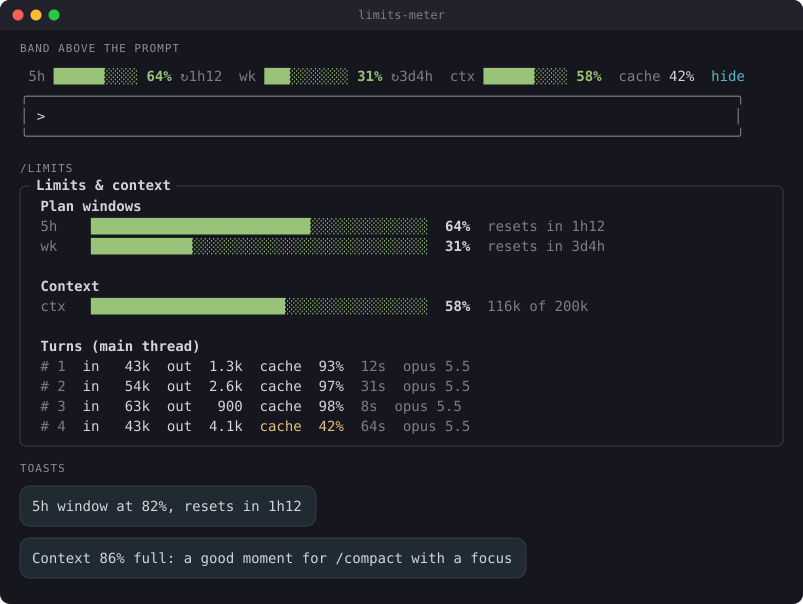
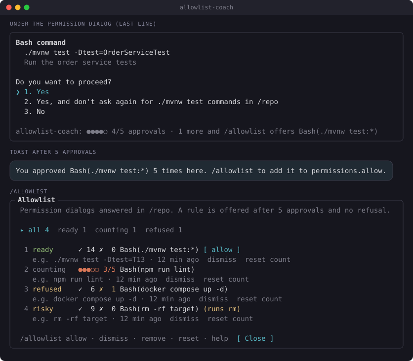
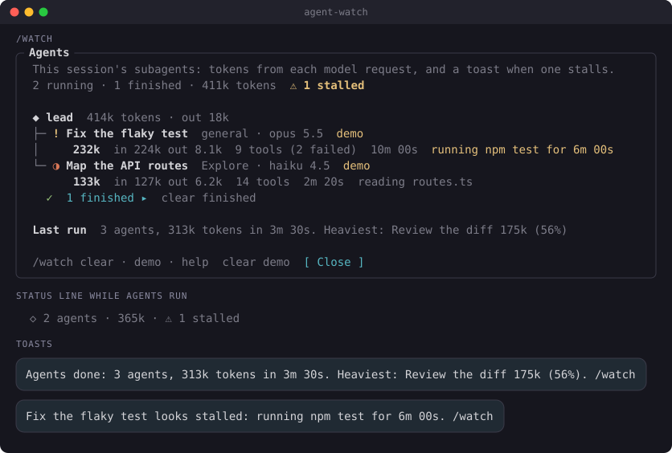
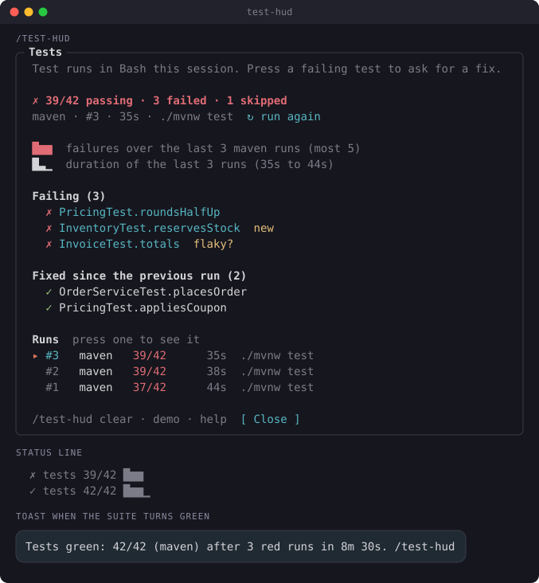
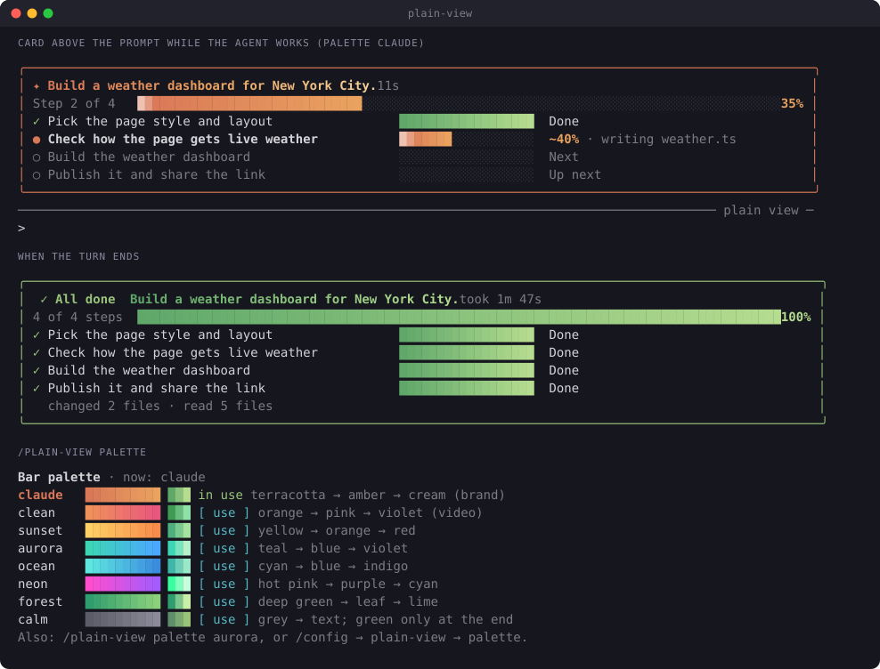

# Claude Code mods

**English** | [Português (Brasil)](README.pt-BR.md)

Mods for everyday Claude Code UX. A mod is a Claude Code plugin made of function hooks: it can
draw a band above the prompt, a pane, a status line entry or a toast. Requires Claude Code
2.1.287 or later.

| Mod | Command | What it does |
| --- | --- | --- |
| [limits-meter](limits-meter/) | `/limits` | Plan limits and context above the prompt: 5-hour and weekly windows with reset times, context fill, cache hit rate, tokens per turn |
| [allowlist-coach](allowlist-coach/) | `/allowlist` | Counts permission dialogs per rule; after 5 approvals with no refusal, offers to add the rule to `permissions.allow`, asking before it writes |
| [agent-watch](agent-watch/) | `/watch` | Subagents at a glance: tokens per agent, a toast when one stalls, and a summary naming the heaviest agent when they finish |
| [test-hud](test-hud/) | `/test-hud` | Test runs at a glance: passing over total in the status line, a sparkline of failures across runs, the failing tests, and a toast when the suite turns green |
| [launchpad](launchpad/) | `/pad` | A menu of one-click actions under the header, above the prompt or in a pane: each button runs an installed command, skill or agent. `◆ pad` opens a control panel: model and effort in one click, this collection's mods, the shortcuts. Pick and order up to 8 in `/pad configuration`, or ship a team's in the repository |
| [plain-view](plain-view/) | `/plain-view` | A quiet transcript: tool rows step aside and the agent's plan shows as a card above the prompt, with the current step, progress bars and a summary when the turn ends |

## Using the mods

The images below are drawn from each mod's real output: `scripts/screenshots/run.sh` drives the
mod with sample data through `claude plugin test` and renders what it drew.

### limits-meter

The band shows on its own after the first response. Commands:

```
/limits          open the pane: plan windows, context in tokens, the last 20 turns
/limits hide     hide the band above the prompt, in later sessions too
/limits show     bring the band back
/limits help     list the commands
```

From 85% context the band and the pane show `compact`, which puts `/compact [focus]` in the
prompt and runs nothing. `details` on the band opens the pane. The pane also says when a window
reaches 100% at the current pace, before it resets, and draws the context fill turn by turn.



#### Install

```
/plugin install limits-meter --marketplace ice-lfernandes/claude-code-mods
```

Or for one session, from a clone: `claude --plugin-dir ./limits-meter`.

### allowlist-coach

It counts on its own each time you answer a permission dialog. Commands:

```
/allowlist             open the pane: every counted rule, numbered, ready ones first
/allowlist allow 1     add rule 1 to permissions.allow (asks first, and which file)
/allowlist dismiss 2   stop offering rule 2
/allowlist remove 1    take rule 1 back out of allow, when the coach added it (asks first)
/allowlist reset 2     set rule 2's count back to zero (asks first)
/allowlist reset       clear this project's counts (asks first)
/allowlist help        list the commands
```

The pane has tabs by status, a filter, and a scrolling list. A risky rule says why it is never
offered.



#### Install

```
/plugin install allowlist-coach --marketplace ice-lfernandes/claude-code-mods
```

Or for one session, from a clone: `claude --plugin-dir ./allowlist-coach`.

### agent-watch

The status line and the toasts show on their own while subagents run. Commands:

```
/watch              open the pane: agent tree with tokens, tool calls and what each one is doing
/watch demo         add three fake agents, one of them stalled, to see the pane
/watch clear        drop finished and demo agents
/watch clear done   drop finished agents only
/watch clear demo   drop demo agents only
/watch help         list the commands
```

Finished agents fold into one line in the pane; press it to open them. A bar shows each
agent's share of the tokens, a name opens its last tool calls, and a stalled agent has an
`investigate` button that asks about it in the prompt.



#### Install

```
/plugin install agent-watch --marketplace ice-lfernandes/claude-code-mods
```

Or for one session, from a clone: `claude --plugin-dir ./agent-watch`.

### test-hud

The status line and the toast show on their own each time a test runner runs in Bash. Commands:

```
/test-hud           open the pane: last run, failing tests (new ones marked), fixed tests,
                    sparkline, last 10 runs
/test-hud demo      add six fake runs that go from red to green
/test-hud clear     drop the runs
/test-hud help      list the commands
```

In the pane, press a failing test to ask Claude for a fix, or `run again` to ask for the same
command: both put the request in the prompt and run nothing. Press a run in the list to see it;
failing tests that failed, passed and failed again are marked `flaky?`. With the `keepHistory`
option the runs carry over to the next session in the same project.



#### Install

```
/plugin install test-hud --marketplace ice-lfernandes/claude-code-mods
```

Or for one session, from a clone: `claude --plugin-dir ./test-hud`.

### launchpad

The menu shows on its own when a session starts and after `/clear`, until the first prompt.
`◆ pad`, under the hint line below the prompt, opens the control panel: the session's
model and effort as buttons (a press runs `/model` or `/effort`; `opus` and `max` turn yellow
when the 5-hour window passes 70%), a button for each mod of this collection installed, and the
shortcuts. Commands:

```
/pad                                        show the menu again
/pad panel                                  open the control panel, as ◆ pad does
/pad configuration                          pane to order, remove and add buttons, up to 8, and the mods to install
/pad list                                   every button with what it runs
/pad add 🔎 Revisão | /code-review          add a button for an installed command, skill or @agent
/pad remove 3                               drop button 3
/pad reset                                  back to the defaults
/pad place header | prompt | pane           where the menu shows: under the header, right above the prompt, or in a pane
/pad off | on                               turn the menu off or back on
```


#### Install

```
/plugin install launchpad --marketplace ice-lfernandes/claude-code-mods
```

Or for one session, from a clone: `claude --plugin-dir ./launchpad`.

### plain-view

Off until you turn it on (`/plain-view on`, the `enabled` option, or the switch in launchpad's
panel). While it is on, the transcript keeps the conversation and drops the tool rows that
worked; a failed or interrupted call, a permission dialog and the agent's questions always draw
in full. Above the prompt, a card follows the request: its title, `Step 2 of 4` with a bar, one
row per task of the agent's list with its own bar (`Done`, `~40%` for the current step, `Next`,
`Up next`). The current step's percentage is an estimate from its tool calls, hence the `~`.
When the turn ends the card turns green with the time it took and the files changed and read,
or grey on Esc; the next request starts a fresh one, and `[-]` folds it.
The agents the main turn hands work to show in one row of the card (`◇ 1 agent running ·
code-review · 3m 12s`, with agent-watch's `/watch` when it is installed), and with no task list
the card waits for them (`Waiting for 1 agent`). A turn with no list that called tools or agents
ends in a small green card (`✓ Done`, the time, the files and the agents); a plain conversation
leaves none.

Two options shape what you see, both in `/config`:

- `agentText`, what stays of the agent's messages: `final` (default: the messages written before
  a tool call step aside, the final answer stays), `none`, `card` (the answer's first sentence in the end card) or
  `all`. Failures, permission dialogs and the agent's questions always show.
- `askForTasks` (on by default): one line in the system prompt asks the model to keep a task
  list for work of more than two steps, or a checklist in its reply when the session has no task
  tool, so the card shows each step; a few tokens per request.
  Off, the card reads the list the agent keeps on its own, or a checklist in its answer.

```
/plain-view on | off          show or hide the card and the tool rows
/plain-view demo              a sample plan in the card for 12 seconds
/plain-view palette           the 8 bar palettes with a sample, and a button to switch
/plain-view palette aurora    switch to one by name
/plain-view help              list the commands
```

The bars are a gradient of the `palette` option's colors (default `claude`) with a shine that
runs while the agent works. Each palette has a dark and a light set, picked by your theme.
`animation: off` keeps the bars still, in the theme's own colors.



#### Install

```
/plugin install plain-view --marketplace ice-lfernandes/claude-code-mods
```

Or for one session, from a clone: `claude --plugin-dir ./plain-view`.

## Install

Each mod's section above has its own install line. In a Claude Code terminal session:

```
/plugin install limits-meter --marketplace ice-lfernandes/claude-code-mods
```

Answer `y` to add the marketplace, then pick a scope.

To try a mod for one session from a clone:

```bash
claude --plugin-dir ./limits-meter
```

## What each mod reaches

A mod runs inside Claude Code with your permissions and is not sandboxed. Read it before you
load it, and run `claude plugin validate <folder>` to list every event it hooks and every call
it makes.

| Mod | Network | Runs processes | Files | Calls a model | Sends data anywhere |
| --- | --- | --- | --- | --- | --- |
| limits-meter | No | No | No | No | No |
| allowlist-coach | No | No | Reads and writes `.claude/settings.local.json`, or `.claude/settings.json` when you pick it, after you confirm | No | No |
| agent-watch | No | No | No | No | No |
| test-hud | No | No | Reads Bash's saved copy of an output too long to show whole | No | No |
| launchpad | No | No | Reads `.claude/launchpad.json` and the agent files in `.claude/agents/`, in the project and in your home folder | No | No |
| plain-view | No | No | No (writes its own options through `/config` when you run `on`, `off` or `palette`) | No | No |

## Developing

```bash
claude plugin validate ./limits-meter
claude plugin test ./limits-meter
claude plugin validate ./allowlist-coach
claude plugin test ./allowlist-coach
claude plugin validate ./agent-watch
claude plugin test ./agent-watch
claude plugin validate ./test-hud
claude plugin test ./test-hud
claude plugin validate ./launchpad
claude plugin test ./launchpad
claude plugin validate ./plain-view
claude plugin test ./plain-view
```

Every mod ships tests, including a render test on the `terminal` and `desktop` surfaces.

### Checks before a merge

GitHub Actions (`.github/workflows/ci.yml`) runs on every pull request and every push to `main`,
with no Claude login and no model call:

- `claude plugin validate` and `claude plugin test` for each mod, on a pinned Claude Code version;
- `scripts/check-shared.sh`: the shared files are the same in every mod;
- `scripts/check-manifests.py`: every JSON file parses, the marketplace lists every mod, and each
  entry's name and description match the mod's `plugin.json`;
- `scripts/check-versions.sh <base>`: a mod changed in the pull request raised its version, since
  Claude Code updates an installed plugin only when the version moves;
- the screenshots match what the mods draw now (`scripts/screenshots/run.sh`, then no diff);
- `shellcheck` on the scripts.

Run the same checks locally before a push:

```bash
./scripts/check-shared.sh
python3 scripts/check-manifests.py
./scripts/check-versions.sh origin/main
./scripts/screenshots/run.sh && git diff --stat screenshots
```

### Shared helpers

A mod installs alone and cannot import another mod's code. The helpers every mod needs live in
`hooks/ui.tsx`, tested by `tests/ui.test.ts`, and both files are copies, the same in each mod:
language and icon style from the options, a prompt fill with its `[blank]` marked, the window of
a long list, a row of clickable verbs, and the number formats. Nothing in it takes `$`: the
engine follows `$` only into functions of the file that uses it, so the calls on `$` stay in
each mod's `register.tsx`. A mod that names tool calls also carries `hooks/phrases.ts` and
`tests/phrases.test.ts`: a tool call in a few words, in both languages (`reading routes.ts`,
`searching "invoice"`). Change one copy, copy it to the other mods, then check them:

```bash
./scripts/check-shared.sh
```

### Pane layout

Every pane follows the same outline, after launchpad's `/pad configuration`:

1. A dim hint on top: what the pane shows and where the figures come from.
2. Sections, each under a bold heading.
3. An empty state that names the next step (`/test-hud demo shows what this looks like`).
4. A footer: the command's verbs as clickable buttons (`/test-hud clear · demo · help`), then a
   close button.

A button that runs something from outside the mod, or undoes the person's data, puts the text in
the prompt instead of running it.

### Shared bands

Several mods can draw on the same line: `AbovePrompt` (limits-meter, plain-view, and launchpad
under `/pad place prompt`) and `PromptHint` (launchpad's `◆ pad`). Each `ui.render` hook there calls
`next(e)` and stacks its own row with what came back, never in its place, so every mod's row
shows:

- `AbovePrompt`: the mod's row first, the rows of the mods beneath it after. The one exception
  is launchpad, whose row goes last so it sits against the prompt box.
- `PromptHint`: the engine's hint first, the mod's row or button after.
- A mod with nothing to show, or switched off, returns `next(e)` as it is.

Otherwise the order between mods follows the order Claude Code loads them; a mod cannot set it.

After a change to what a mod draws, regenerate the images:

```bash
./scripts/screenshots/run.sh
```

## License

MIT. See [LICENSE](LICENSE).
