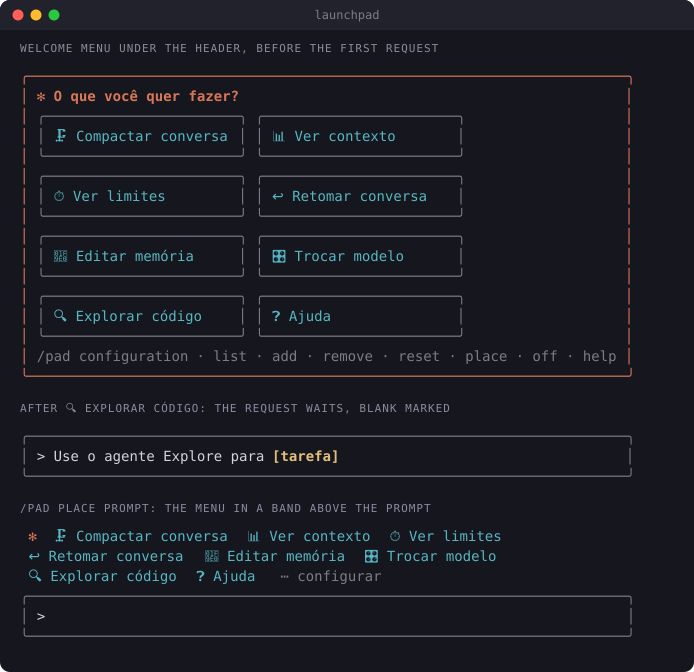

# launchpad

A menu of one-click actions under the Claude Code header, below the prompt or in a pane of its
own, so nobody has to know a `/command` before they can get something done. Each button runs a command, a skill or an agent
that this session has installed.



- **Shows when a session starts** with an empty conversation, and after `/clear`: a framed card
  under the header, each button an icon and an action in a bordered tile, in columns that fit the
  window. The card is the output of `/pad`, which the mod runs for you, so it sits in the
  conversation and scrolls up as the conversation grows. `/pad` draws a fresh one at any time.
- **Two kinds of button,** told from the text:
  - `/name` runs that command or skill: `🗜️ Compactar conversa` runs `/compact`.
  - `/name [blank]` puts the command in the prompt with the blank marked, for you to fill in and
    send: `/code-review [level]` waits for the level. Arguments with no brackets
    (`/code-review high`) run as written. A command whose arguments are all optional runs bare:
    `/clear [name]` runs `/clear`.
  - `@name` calls that agent: `🔍 Explorar código` puts `Use o agente Explore para [tarefa]` in
    the prompt with the blank marked, for you to say what to explore.
- **Only what is installed.** A button shows, and can be added, only when this session has its
  command, skill or agent: the commands and skills Claude Code lists, the built-in agents
  (`general-purpose`, `Explore`, `Plan`) and the agent files in `.claude/agents/` of the project
  and of your home folder. A button whose command another session has (`/limits` comes with
  [limits-meter](../limits-meter/)) stays in your list and shows where it works.
- **A row of /pad's own arguments** under the buttons: `configuration · list · add · remove ·
  reset · place · off · help`. `configuration` opens the pane, `list` and `help` print as a dim line in
  the conversation (Claude does not read it), `off` turns the menu off. `add`, `remove` and
  `reset` wait in the prompt (`/pad add [nome] | [/comando ou @agente]`), so a stray click changes
  nothing.
- **Where it shows is your choice** (`/pad place`, or the `placement` option):
  - `header`, the default: the card under the header described above.
  - `prompt`: the buttons in a row below the prompt that stays there, under Claude Code's own
    hint line (`? for shortcuts`), with `⋯ configure` to open the pane.
  - `pane`: a pane of its own, a tab like those of `/limits` and `/watch`, with the card's
    bordered tiles. It opens when a session starts and after `/clear`, and on `/pad`. Claude Code opens a pane only with the
    keyboard on it: `Esc` closes it and gives the prompt back.
- **Up to 8 buttons** that work here. The defaults: compact the chat, see context, see limits,
  resume a chat, edit memory, switch model, explore the code, help.

## Commands

```
/pad                                  show the menu again
/pad configuration                    pane to order, remove and add buttons
/pad list                             every button, numbered, with what it runs
/pad add 🔎 Revisão | /code-review    a button that runs a command or skill
/pad add Revisor | @revisor           a button that calls an agent
/pad remove 3                         drop button 3
/pad reset                            back to the default buttons
/pad place header | prompt | pane     where the menu shows: under the header, below the prompt, or in a pane
/pad off                              turn the menu off: no card at the start, after /clear or on /pad
/pad on                               turn it back on
```

`/pad configuration` (or `/pad config`) opens a pane with your buttons, each with `↑`, `↓` and
`remover`, and below them every installed command, skill and agent not yet in the menu, with a
filter to type into and `+ adicionar` on each. Enter in the filter adds the first match. A
command that takes an argument comes in with it as a blank (`/code-review [level]`), from the hint
Claude Code shows for it in the `/` menu. The mod learns the hints as that menu lists the
commands, so one you have not yet seen there in this session comes in bare: add the blank with
`/pad add`. A hint of optional arguments only (`[name]`, `[auto|<tokens>]`) gives no blank: the
button runs the command bare. A button saved with such blanks by an earlier version
(`/clear [name]`) is saved back bare once Claude Code lists the command. Once 8 buttons work, the
pane says the menu is full until you remove one.

`/pad off` is kept across sessions and hides the cards already in the conversation too. The
other commands and the pane go on working, so you can set the menu up before `/pad on`. The
`showOnStart` option below only stops the card at the start and after `/clear`.

The icon in `/pad add` is optional. It can be any emoji or symbol, or a built-in name between
colons (`/pad add :chart: Vendas | /cost`): `folder`, `doc`, `pen`, `search`, `compress`, `gauge`,
`chart`, `table`, `mail`, `undo`, `spark`, `brain`, `sliders`, `help`, `agent`, `tool`, `plug`. A
plain first word stays in the label. An agent button can carry its task (`@revisor revise
[arquivo]`); without one, the prompt waits with `[tarefa]`. Your list is kept across sessions.

## Buttons for a whole team

A project can ship its own buttons in `.claude/launchpad.json`:

```json
{
  "buttons": [
    { "icon": "🧾", "label": "Fechamento do mês", "text": "/fechamento" },
    { "icon": "chart", "label": "Revisor", "text": "@revisor" }
  ]
}
```

Each text is a `/command` or an `@agent`, and the button shows only when the session has it.
They show after your own, up to 8 in the menu. Their text comes from the repository, so a project
button never runs a command on its own: a press only puts its text in the prompt, and you read it
before pressing Enter. To remove one, edit the file.

## Options

Set them in `/config` or under `pluginConfigs` in `~/.claude/settings.json`, keyed by the installed
name (`launchpad@lfernandes-mods`).

| Option | Values | Default |
| --- | --- | --- |
| `language` | `auto`, `pt-BR`, `en`: the default buttons and the messages. `auto` follows the system's `LANG`: Portuguese for `pt_*`, English otherwise and when `LANG` is unset | `auto` |
| `icons` | `auto`, `emoji`, or `symbol` (`⇲ ▥ ◔`) for terminals that draw emoji at odd widths. `auto` uses symbols in a JetBrains IDE's terminal (IntelliJ, PyCharm, ...: `TERMINAL_EMULATOR=JetBrains-JediTerm`), which gives many emoji one column, and emoji elsewhere | `auto` |
| `showOnStart` | `false` shows the menu only on `/pad` | `true` |
| `placement` | `header`, `prompt` or `pane`: where the menu shows. `/pad place` overrides it and is kept across sessions | `header` |

In the desktop app the buttons are native buttons and always use emoji.

An option already saved in your settings wins over a new default. Installing the plugin can save
every option with the value it had then, so after an update that adds `auto` to an option, set it
to `auto` yourself to get the new behaviour.

## Known limits

- **Hover needs a terminal that reports mouse motion.** Over a tile, the border and label turn the
  accent color and the tile tints. VS Code's terminal reports the pointer as it moves; a JetBrains
  IDE's terminal reports clicks but not motion, so there the tiles do not light up. Clicks work in
  both.
- **The border rows of a tile do not take a click.** Only a button takes a press, and a terminal
  inverts the button under the pointer, which turns a border into a solid bar. The whole row
  inside the border is the button.
- **Emoji widths depend on the terminal.** Claude Code counts an emoji as two columns. A terminal
  that gives it one (a JetBrains IDE, VS Code with `terminal.integrated.gpuAcceleration` set to
  `off`) shifts the rest of the row and bends the borders. `icons: auto` covers JetBrains; in
  VS Code, turn GPU acceleration on, or set `icons` to `symbol`.
- **Agents: the built-in ones and your files.** The catalog holds `general-purpose`, `Explore`,
  `Plan` and the `.md` files directly in `.claude/agents/` of the project and of your home folder.
  An agent a plugin brings, or one in a subfolder, counts as not installed: Claude Code gives a mod
  no list of agent types.
- **Argument hints come from the `/` menu.** The pane gives a command its argument as a blank
  from the hint Claude Code shows in the `/` menu. The mod learns the hints as that menu lists the
  commands, and forgets them when it reloads.
- **The menu is a row of the conversation.** It scrolls away with the conversation, and `/pad`
  draws a new one. Claude reads `/pad`'s one-line output (`Menu de atalhos do launchpad.`), not
  the buttons.

## Install

```
/plugin install launchpad --marketplace ice-lfernandes/claude-code-mods
```

Or for one session: `claude --plugin-dir ./launchpad`

## What it reaches

| Mod | Network | Runs processes | Files | Calls a model | Sends data anywhere |
| --- | --- | --- | --- | --- | --- |
| launchpad | No | No | Reads `.claude/launchpad.json`, and the agent files in `.claude/agents/` of the session's folder and of `$HOME` | No | No |

A pressed button does what typing would do: it runs a slash command or fills the prompt box.
Those go through Claude Code and every other mod's hooks as usual, so permission dialogs and other
guards still apply. The mod keeps your list of buttons in its plugin store, on this machine.
